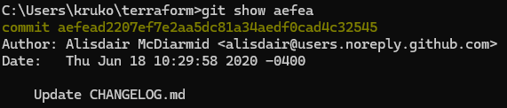
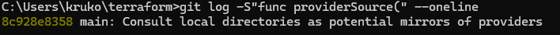
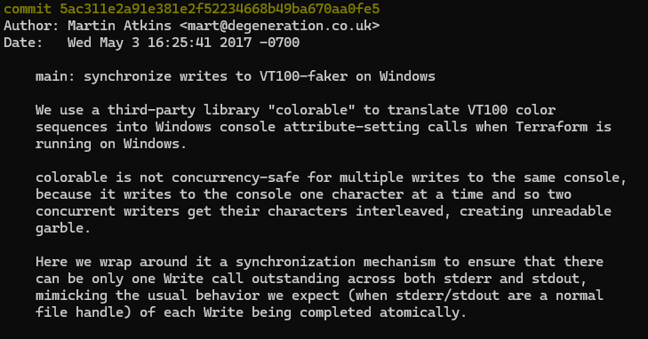

# Домашнее задание к занятию «Инструменты Git» (Крюков Николай)

### Цель задания

В результате выполнения задания вы:

* научитесь работать с утилитами Git;
* потренируетесь решать типовые задачи, возникающие при работе в команде. 

### Инструкция к заданию

1. Склонируйте [репозиторий](https://github.com/hashicorp/terraform) с исходным кодом Terraform.
2. Создайте файл для ответов на задания в своём репозитории, после выполнения прикрепите ссылку на .md-файл с ответами в личном кабинете.
3. Любые вопросы по решению задач задавайте в чате учебной группы.

------

## Задание

В клонированном репозитории:

1. Найдите полный хеш и комментарий коммита, хеш которого начинается на `aefea`.

2. Ответьте на вопросы.

* Какому тегу соответствует коммит `85024d3`?

коммит не найден по данному запросу

* Сколько родителей у коммита `b8d720`? Напишите их хеши.

* Перечислите хеши и комментарии всех коммитов, которые были сделаны между тегами  v0.12.23 и v0.12.24.

хеши и комментарии не найдены по данному запросу

* Найдите коммит, в котором была создана функция `func providerSource`, её определение в коде выглядит так: `func providerSource(...)` (вместо троеточия перечислены аргументы).

* Найдите все коммиты, в которых была изменена функция `globalPluginDirs`.

коммиты не найдены по данному запросу

* Кто автор функции `synchronizedWriters`? 

*В качестве решения ответьте на вопросы и опишите, как были получены эти ответы.*

---

